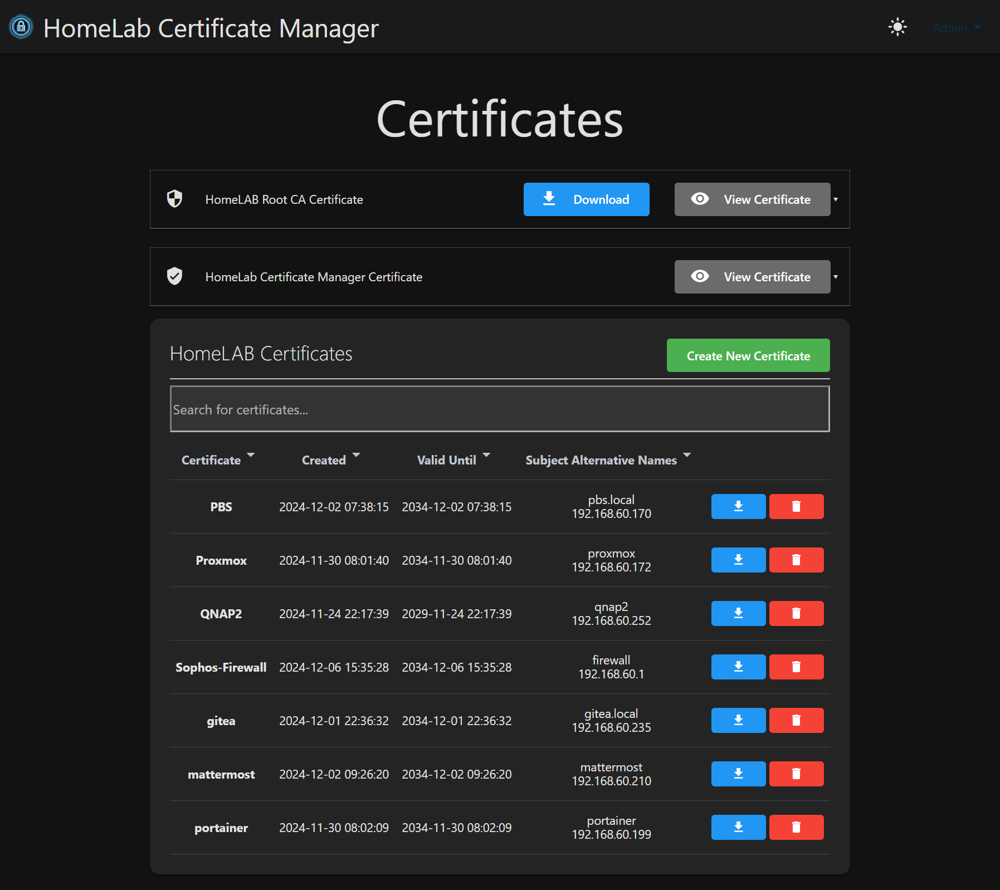

# Homelab Cert Manager

## Overview

Homelab Cert Manager is a Go project designed to manage SSL/TLS certificates for your homelab environment.
This tool can generate a Homelab Root-Certificate and additional certificates for your homelab-services like docker-containers or devices.

All you need to do is import and trust the generated Root-Certificate once to your PC and generate a new certificate for each of your services.

These certificates can then be used to configure SSL for or replace the self-signed cert of your HomeLAB services.

Then your internal sites show secure connections (without warnings) in all modern browsers.

## Features

- **Internal Certificate Management:** Generate and manage internal SSL/TLS certificates.
- **Security:** CSRF protection, path traversal prevention, secure file permissions.
- **4096-bit RSA Keys:** Strong encryption for all certificates.
- **Ease of Use:** Simple configuration and operation.
- **Dark/Light Mode:** Toggle between dark and light themes.
- **Search/Filter:** Easily search and filter certificates in the table.
- **Settings Page:** Configure certificate defaults and other settings.
- **PKCS#12 Export:** Export certificates in .pfx format for Windows.

## Screenshots



## Security Features

Homelab Cert Manager includes comprehensive security measures:

- **CSRF Protection:** All forms include CSRF tokens to prevent cross-site request forgery attacks.
- **Path Traversal Prevention:** User input is sanitized to prevent directory traversal attacks.
- **Secure File Permissions:**
  - Private keys: 0600 (owner read/write only)
  - Certificates: 0644 (world-readable)
  - CA directory: 0700 (owner only)
  - Data directories: 0750 (group readable)
- **Strong Encryption:** 4096-bit RSA keys for all certificates.
- **Session Security:** Secure session handling with proper error checking.
- **Debug Logging:** Configurable debug logging (disabled by default).

## Getting Started

### Using Docker

To use Homelab Cert Manager, download and install the Docker image:

```bash
docker pull ghcr.io/cbrosius/homelab_cert_manager/homelab_cert_manager:latest
docker run -p 8443:8443 -v $(pwd)/data:/app/data ghcr.io/cbrosius/homelab_cert_manager/homelab_cert_manager:latest
```

### Building from Source

Alternatively, you can clone the repo and compile the project:

```bash
git clone https://github.com/cbrosius/homelab_cert_manager.git
cd homelab_cert_manager
go build -o homelab_cert_manager .
./homelab_cert_manager
```

### Initial Setup

When Homelab Cert Manager has started, go to `https://<IP-Of-HomeLAB-Cert-Manager>:8443`

Use **admin/admin** as initial Username/Password (you will be prompted to change the password on first login).

1. Create HomeLAB Root Certificate
2. Add the new HomeLAB Root Certificate to trusted Root-Certificates on your local machine
3. (Optional) Replace the self-signed HomeLAB Cert Manager Certificate with a CA-signed one
4. Start creating certificates for your services
5. Configure/use the new certificates for your services

## Configuration

### Debug Logging

To enable debug logging, add the following to `data/settings.json`:

```json
{
  "debug": true
}
```

Debug logging is disabled by default for security.

### Certificate Defaults

Certificate defaults can be configured through the Settings page:

- Validity period (years)
- Organization
- Organizational Unit
- Country, State, Location
- Email

## File Permissions

The application creates directories with the following permissions:

| Path | Permission | Description |
| --- | --- | --- |
| `data/root-cert` | 0700 | CA private key storage (owner only) |
| `data/certs` | 0750 | Issued certificates |
| `data/certmanager-cert` | 0750 | Application's own certificate |

Private key files are created with 0600 permissions (owner read/write only).

## Security Considerations

- Always use HTTPS (the application enforces TLS on port 8443).
- Change the default admin password on first login.
- Keep the `data/root-cert` directory secure (contains CA private key).
- Backup the `data` directory regularly - losing the CA private key will invalidate all issued certificates.
- The `data/settings.json` file is automatically generated and should not be committed to version control.

## License

See [LICENSE](LICENSE) file for details.
